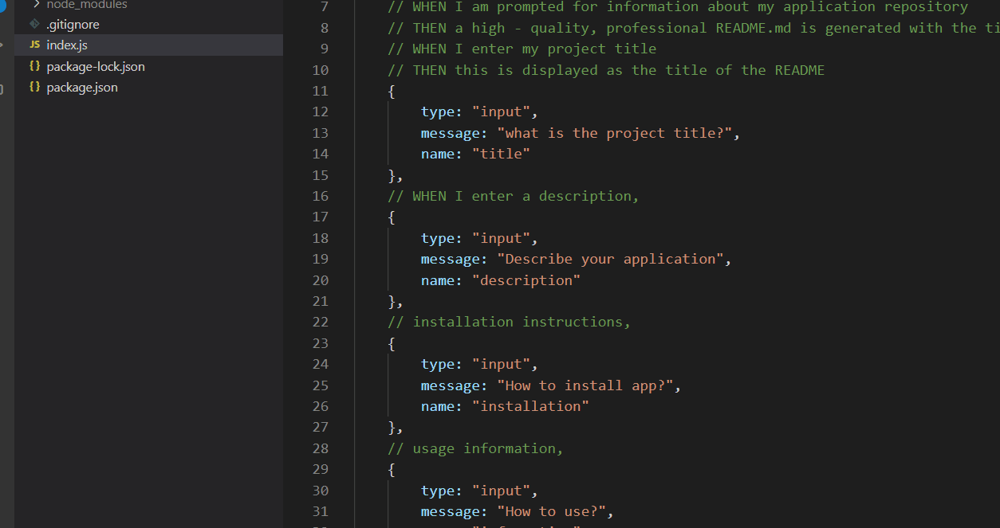

# **Professional Readme Generator**

* [Description](description)
* [Installation](installation)
* [Information](information)
* [Contribution](contribution)
* [Instructions](instructions)
* [Contact](contact)

## Description
In this assignment I created a readme generator to creat a professional layout for future projecs. 
## Installation
Run the program in VS and answer the questions generated.
## Information
When you have the aplication opened in VS code, type node index to run it.
## Instructions
Try it out

## Contact
* GitHub: cheetboy159
